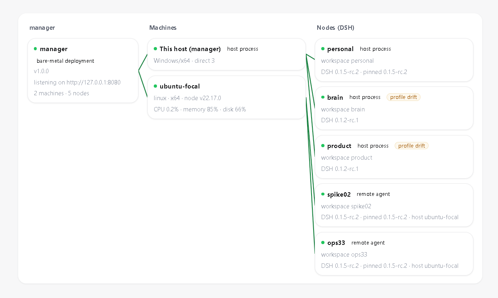

# DAC — Dispatched Agent Cluster

> **One Manager. A Fleet of Agents. More servers. More agents.**

DAC is an MIT open-source control plane for managing and exposing fleets of containerized
agent nodes (currently built on DeepSeek Harness) across multiple servers, with unified
conversation and API access.
Default install = manager (HQ) + brain (chief controller) + personal workspace. One command, up in 5 minutes.

> 中文文档见 [README.zh.md](./README.zh.md)。The UI ships with **English as the default
> language and Chinese one click away** (the language switcher lives in the sidebar's ⋮ menu).

## One-line install

**Linux server (containers, recommended):**

```bash
curl -fsSL https://raw.githubusercontent.com/litestartup-com/hellodac/v1.0.0/install.sh -o install.sh && bash install.sh
# pros: curl -fsSL https://raw.githubusercontent.com/litestartup-com/hellodac/v1.0.0/install.sh | bash
```

**Windows (bare metal):**

```powershell
irm https://raw.githubusercontent.com/litestartup-com/hellodac/v1.0.0/install.ps1 -OutFile install.ps1; powershell -ExecutionPolicy Bypass -File .\install.ps1
# pros: irm https://raw.githubusercontent.com/litestartup-com/hellodac/v1.0.0/install.ps1 | iex
```

The scripts are idempotent: already-installed components are skipped, and re-runs never overwrite config or data.
The only input needed is your DeepSeek API key (pre-set `DEEPSEEK_API_KEY=...` for a fully unattended install);
first login forces a password change. Full manual: `docs/USER-GUIDE.md`.

## What it is

DeepSeek Harness provides the agent runtime (sessions / tools / sandbox / filesystem); DAC provides the control plane:
auth, chat relay, brain dispatch, node and machine management, skill inventory, billing, backup & restore.

Concept hierarchy (see `docs/USER-GUIDE.md`):

```
server ──► node (= one DSH agent process + its own DSH_HOME) ──► workspace (identity + dir + preset + sandbox) ──► session
```

- **Brain** = manager-level chief controller: cross-domain planning, work orders, fleet queries; read-only on workspaces, execution is always delegated.
- **Workspace** = files-as-truth boundary: one git repo per workspace, one commit per run (audit trail).

## Screenshots



## Features

- **Chat UI**: multi-turn conversation, streaming output, tool-call cards, inline question/authorization answers, context usage, session model selection, and restricted read-only/workspace-write access switching when the endpoint supports it
- **Brain dispatch**: conversational orchestration + delegation frames (click to jump to the delegated session) + session reuse
- **Multi-node fleet**: three views on `/nodes` — a live **topology** (manager → machines → nodes, heartbeat edges), the node list, and the machine (node-agent) directory; guided node wizard; start/stop/restart/logs; the wizard offers node forms — **container worker (isolated)** or **host process (whole-machine capability, warning + audit)**; host-process nodes install dependencies into their own directory, never the global npm
- **Concurrent sessions**: serial within a session, parallel across sessions (native DSH semantics + git commit locks + surfaced conflicts)
- **Scheduled runs**: the scheduler API drives unattended work (disabled at draft time; brain dispatches are budget-capped)
- **Skill inventory**: `/skills` page lists skills per workspace with version mapping (= workspace git HEAD)
- **In-app notifications**: bell — offline machines / abnormal nodes / budget breaker / brain task completions
- **Bilingual UI**: English by default, Chinese switchable per user (`?lang=` → cookie → `Accept-Language`); adding a language is one JSON file plus one registry line
- **Billing**: peak/off-peak pricing (**weekends are all off-peak**), per-run cost, monthly summary, per-workspace breakdown
- **Backup & restore**: on-demand `npm run backup` + one-click restore; optional automatic snapshots (`backup.auto: true`, default off — 15-min DB snapshots + retention policy 24h full → daily 30 days → weekly 12 weeks; interval tunable via `backup.interval_minutes`, e.g. 1440 = daily)
- **Service**: auto-start on boot (Windows Task Scheduler / Linux systemd)
- **Self-update**: backup → pull → build → health probe, auto-rollback on failure
- **Native GUI one-click open**: each node row carries a "Native GUI" card — one SSH
  tunnel command (the key stays on your machine) plus a one-click open of the node's
  native UI. The 0.1.5 token is captured from node logs automatically and follows
  restarts. (The DSH web UI binds loopback only; reverse-proxying is not possible —
  see facts card dsh-facts §11.)
- **Per-node DSH version**: the (dsh, facade) version matrix is the single source of
  truth; nodes can pin a version at creation, the nodes page shows the configured
  version + drift state, and one click aligns it (reseed → reinstall → restart)
- **Fleet (multi-server)**: a machine directory plus one join command per server
  (node-agent resident service, outbound dialing, zero inbound ports); the wizard's
  "host" picker creates nodes as remote host processes; nodes keep running when the
  manager is down, and the agent reconnects with reconciliation

## Open a node's native GUI (SSH tunnel)

1. On the nodes page, click "Configure native access" once: SSH user / host / port
   and the local mapped port — optional SSH private-key path (your machine's key
   file, so the command can carry `-i`);
2. Run the `ssh -L` command from the card in a terminal (keep it open);
3. Click "Open GUI" — a new tab lands on that node's native DSH UI.

**Local nodes skip the tunnel entirely**: when a node's endpoint URL is loopback
(127.0.0.1/localhost), the card switches to "direct open" — the browser and the
node are both on loopback, so one click opens the native UI (the URL uses the
port the node itself printed in its startup line, token included).

The manager only generates the "how to connect" command — **the SSH private key
never enters the manager** (only an optional local key *path* is recorded). Both
tunnel ends bind loopback, and node GUI ports are published on the host's
127.0.0.1 only (never the public surface).

## Per-node DSH version

The node wizard accepts an optional `dsh_version`, validated against the version
matrix `SUPPORTED_DSH` (`src/dsh-matrix.ts` — each row pairs a DSH version with a
facade ref; unknown versions are rejected, and pairs not yet verified install with
a warning). Each node's profile is pinned to its version; the nodes page shows the
configured version plus drift state, and "Align version" reseeds the profile,
reinstalls dependencies, and restarts the node on its pinned version. Container
nodes use image `hellodac/dac-node:<version>`. Every node row also carries a version
dropdown — switching versions is a page action (container = image rebuild;
process = reseed + reinstall + restart), no config edits.

## Machines & fleet (multi-server)

1. On the nodes page, click "Add machine" in the Machines section → get a join
   command (token valid 15 minutes, one-time);
2. Run the join command on the target server (installs the node-agent as a
   **system service** and registers the machine; it needs root, so the generated
   command pipes into `sudo bash`);
3. In the node wizard, pick the machine in the "Host" dropdown and fill in the
   node address (`http://IP:port` reachable from the manager) — the node is
   created as a host process on that machine (whole-machine capability,
   confirmation + audit).

- One node-agent per server, zero config beyond `MANAGER_URL` and the join
  token, **zero inbound ports** (the agent dials out);
- **Nodes keep running when the manager is down** — the agent reconnects and
  reconciles on recovery;
- The machines page can **revoke** (token dies immediately) or **rotate the key**
  (online machines only; the new token is delivered over the command channel
  with a 30-minute grace window for the old one);
- **Observability**: each machine row shows live CPU/memory/disk usage (60s
  heartbeat sampling, 7-day trend kept by the manager, series available via
  `GET /api/agents/:id/metrics`); agent outages and node anomalies land in the
  bell; stale versions get a "update available" badge with one-click self-update;
- Security: the agent is a fixed command set (not a generic shell); node facade
  ports must be firewalled to the manager's egress IP; the GUI still goes
  through the user-side SSH tunnel.

### Ops assistant nodes

Critical servers (production / the manager host) should also run an **ops
assistant node** (placement rule D3): in the node wizard, after picking the host
and address, choose sandbox mode **danger-full-access (whole machine · high
risk)**:

- That tier grants whole-machine capability (files/terminal/system); dangerous
  operations must pass **approval cards** for human sign-off (facade side, Q2
  decision); creation and unlocking are both audited;
- **Server ops account credentials stay on the node's machine** and are never
  shipped by the manager;
- The node must unlock full access on its side (facade `host.describe`
  allowFullAccess); until unlocked, the "full access" tier in chat shows locked.

### Scale & backpressure boundaries (M4-2)

- **Channel rate limits**: join issue 20/min, agent register 10/min, command
  long-poll 240/min, event report 240/min, revoke/rotate 20/min; long-poll wait
  ≤25s per cycle, event batches ≤100, log chunks ≤32KB — all limits are counted
  per agent / per user independently.
- **Log limits**: the manager keeps a 64KB in-memory ring per agent node; the
  agent caps `node.log` at 50MB and rotates it before spawn (keeping one `.1`
  generation for crash forensics).
- **Single manager comfortable up to ~50 machines**: each machine holds one
  long-poll connection (heartbeat ~30s), so N machines ≈ N/30s poll requests
  plus event posts; SQLite single-writer and the per-agent command queue stay
  comfortable within that. Larger fleets → multiple managers (planned).

### Facade firewall whitelist (required before going cross-network)

A node's facade port (e.g. 3081) is exposed on its server and **must only allow
the manager's egress IP**; the GUI uses the user-side SSH tunnel (loopback) and
is unaffected. The manager's egress IP is the source IP the manager server uses
for outbound traffic (usually its EIP/public IP in the cloud).

- **Linux (ufw)**:
  `sudo ufw allow from <manager-egress-IP> to any port 3081 proto tcp && sudo ufw enable`
- **Linux (firewalld)**:
  `sudo firewall-cmd --permanent --add-rich-rule='rule family="ipv4" source address="<manager-egress-IP>" port port="3081" protocol="tcp" accept' && sudo firewall-cmd --reload`
- **Cloud security group**: inbound only `<manager-egress-IP>/32` → node port,
  deny everything else.
- **Acceptance**: `curl` the facade from a non-whitelisted IP → refused; the
  manager's probe still shows the node live on the `/nodes` page.


## Upgrade

- **Bare metal**: `npm run update` — backup → pull → build → health probe,
  auto-rollback on failure.
- **Container (compose)**: set `MANAGER_VERSION` in `.env` to the new tag, then
  `docker compose up -d`.
- **Node DSH version**: pick a version from the node row's dropdown on `/nodes`.
- **Config migration is automatic**: old `manager.config.yaml` files are upgraded
  at boot (original backed up as `.pre-mig.bak`); no manual edits are needed on
  upgrade.

## Run from source (developers)

Prerequisites: Node ≥ 20 (22 recommended), git, DeepSeek Harness (version in `COMPAT_DSH_VERSION`);
node dependencies are installed by setup via npm, no global pnpm needed.

```powershell
git clone <repo-url>
cd hellodac
npm install
npm run setup          # self-check (node/git/dsh) + initialize workspaces/nodes/config
npm run build
npm start              # start manager, auto-spawns managed nodes
```

### Refreshing the container node's dependency lock

The node image installs its profile from a committed lock so that the same image tag always
contains the same dependency tree (without it, a registry change silently rewrites the image).
When you bump `SUPPORTED_DSH` in `src/dsh-matrix.ts`, refresh the lock for each version:

```bash
DSH_VERSION=0.1.5-rc.2 npm run lock:profile   # writes images/node/profile-lock/<version>.package-lock.json
npm test                                     # profile-lock.test.ts checks lock vs matrix
```

Commit the lock together with the version bump; the image build uses `npm ci` when a lock is
present and warns (falling back to `npm install`) when it is not.

## CLI overview

| Command | Purpose |
| --- | --- |
| `npm run setup [--force]` | Initialize / reinstall (`--force` keeps customized workspaces) |
| `npm start` | Start manager (auto-spawns managed nodes) |
| `npm run nodes -- up/down/list/logs <name>` | Node lifecycle (UI on /nodes page) |
| `npm run backup [-- list]` / `npm run restore -- latest` | Backup / restore (probes whether manager is running before restore) |
| `npm run service -- install/uninstall/status` | Auto-start service |
| `npm run update` | Self-update (auto-rollback on failure) |
| `npm test` / `npm run typecheck` | Tests / type check |

## Configuration

`manager.config.yaml` is the single source of truth: `endpoints` (entry + spawn lifecycle for each DSH process),
`agents` (workspace bindings), `runner` (timeouts/silence/budget), `pricing` (peak/off-peak windows + weekend rule),
`brain.daily_budget_usd` (brain dispatch breaker). Secrets live only in `.env` (`GW_KEY_*` / `BRAIN_TOKEN`), never in git.

## Documentation

| Doc | Contents |
| --- | --- |
| `docs/USER-GUIDE.md` | User manual (install / brain / nodes & machines / billing / backup) |
| `README.zh.md` | This README in Chinese |
| `SECURITY.md` | Threat model, how to report a vulnerability, hardening checklist |
| `CONTRIBUTING.md` | How to get a change merged (tests first, i18n rules, container rules) |
| `CODE_OF_CONDUCT.md` | Contributor Covenant |
| `CHANGELOG.md` | Changelog |

> **This repo carries user-facing docs only.** Design drafts, roadmaps, implementation plans, review records,
> release procedures and upstream behavior fact cards live in the private internal design library.
> **Delivered capabilities are in `CHANGELOG.md` and GitHub Releases; no public promises for unreleased features.**
> Code, config samples and the user manual are the complete runnable, self-hostable deliverable.

## Tests

```powershell
npm test   # all green (count asserted by CI, not hardcoded)
```

## License

MIT
